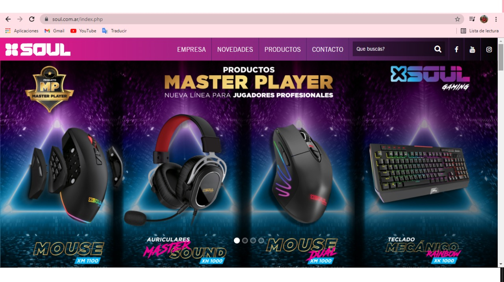
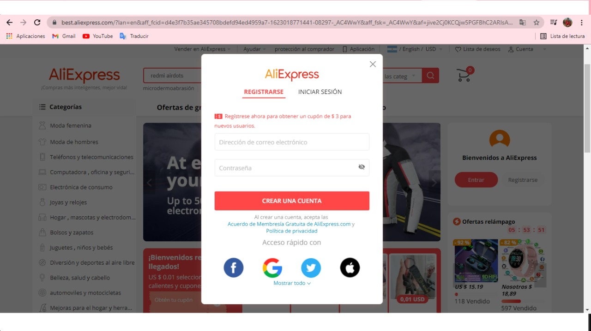
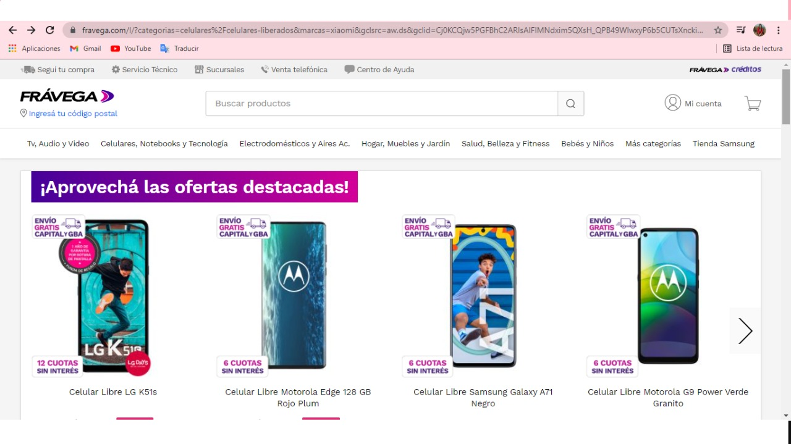
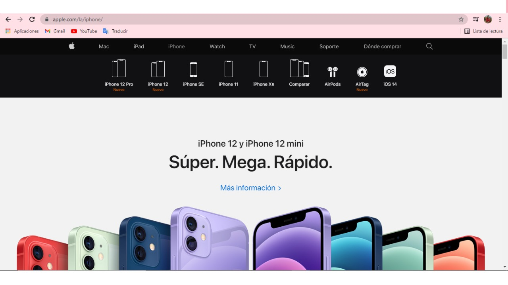
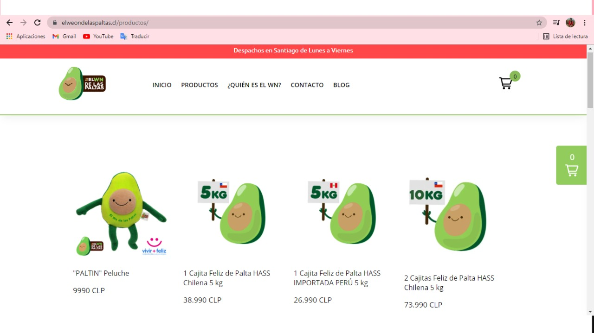
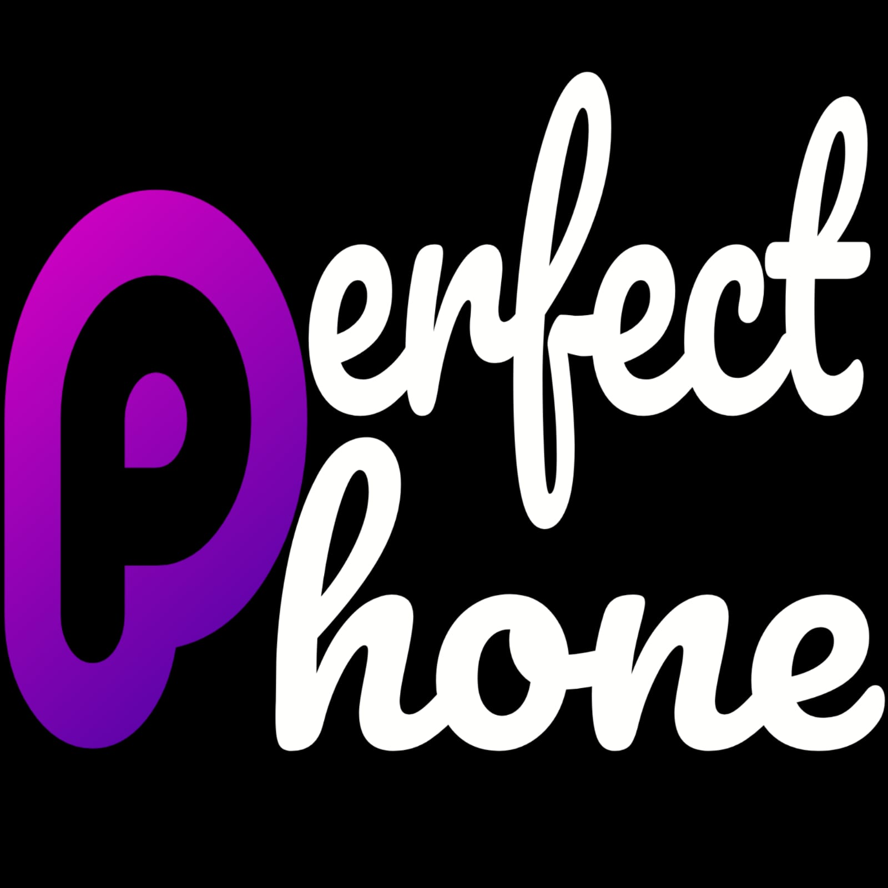

## **Grupo 6 Perfect Phone**
___
### **Acerca del proyecto**
Nuestro proyecto se basa en la venta de accesorios de telefonos.
___
### **Publico objetivo**
Desde jovenes hasta adultos, ya que los productos son de interes general.
___
### **Caracteristicas Principales**
- Facil acceso para el registro y las compras.
- Estrategias de ventas visuales en la pagina, como por ejemplo ofertas.
- Diseño moderno.
___
### **Integrantes**
- **Elias Gonzalez**

25 años, venezolano. Tecnico en computadoras y celulares, amante de la tecnologia y futuro programador.

- **Wendy Torres**

Venezolana, 23 años, estudiante en el area de programación. Me gusta aprender y aprovechar las oportunidades que me ayuden a crecer profesionalmente.

___
### **Referentes**
- **SOUL**

Diseño creativo.

- **AliExpress**

Facil acceso para el registro e ingreso.

- **FRÁVEGA**

Tiene estrategias de ventas llamativas para el cliente.

- **Apple**

Posee buen color y orden para organizar los productos.

- **ElWeonDeLasPaltas**

Ofrece una funcionalidad practica de carrito corredizo al lateral de la pagina.

___
### **Wireframes**
Para acceder al Wireframes click [Aqui](https://www.figma.com/file/2orbMlNfO97jfdHHqfMwvy/Perfect-Phone?node-id=0%3A1 "Aqui")
___
### **Tipografia**

|**Estilo Tipografico (Sans Serif)**|**Ejemplo**|**Representa**
| ------------ | ------------ | ------------ |
|Roboto| [Click Aqui](https://fonts.google.com/specimen/Roboto?category=Sans+Serif&preview.size=64&preview.layout=row#standard-styles "Click Aqui")|Seguridad
|Sarabun (opcional)|[Click Aqui](https://fonts.google.com/specimen/Sarabun?category=Sans+Serif&preview.size=64&preview.layout=row#pairings "Click aqui")|Neutralidad

___
### **Colores utilizados**
- **Negro**
- **Gris**

___
### **Nuestro logo**
 Imagotipo: es un elemento que está compuesto por texto y por una imagen representativa o simbólica. Para considerarlo un imagotipo es necesario que los dos elementos estén separados, quiere decir que el logo se conforma por dos elementos independientes.

___
### **Gracias por leer hasta acá.**
